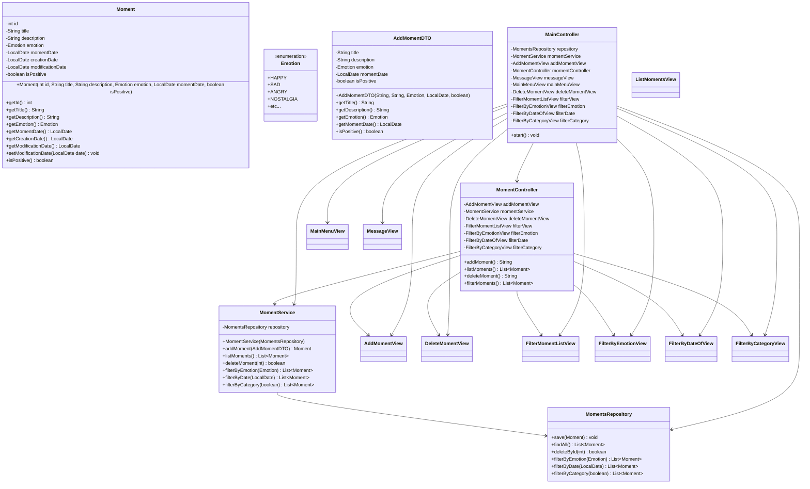

# Proyecto Gestor de Momentos

Este proyecto es una aplicación de consola en Java diseñada para registrar, listar, filtrar y eliminar momentos importantes de la vida de un usuario.  
Cada momento se enriquece con datos como título, descripción, emoción, fecha y categoría (positivo/negativo).

## 🚀 Funcionalidades actuales
- Añadir momentos (con DTO `AddMomentDTO`).
- Listar todos los momentos almacenados.
- Filtrar momentos por:
  - Emoción
  - Fecha
  - Categoría (positivo/negativo)
- Eliminar momentos por identificador único.
- Menú interactivo en consola.

## 🛠️ Arquitectura del proyecto
El proyecto sigue el patrón MVC:
- **Model**: Contiene la entidad `Moment` y la enumeración `Emotion`.
- **View**: Clases para la interacción por consola (`MainMenuView`, `AddMomentView`, etc.).
- **Controller**: Maneja la lógica de flujo (`MainController`, `MomentController`).
- **Service**: Procesa la lógica de negocio (`MomentService`).
- **Repository**: Gestiona los datos en memoria (`MomentsRepository`).

## 📚 Tecnologías usadas
- **Java 17**
- **JUnit 5** para pruebas unitarias.

## 🔨 Instalacion
1. **Clonar el repositorio**
   ```bash
   git clone https://github.com/usuario/nombre-del-proyecto.git
   cd nombre-del-proyecto
   ```

2. **Requisitos previos**
   - Tener instalado **Java 17** o superior.
   - Tener instalado **Maven** (para compilación y gestión de dependencias).
   - Un IDE recomendado: **IntelliJ IDEA** o **Eclipse**.

3. **Compilar el proyecto**
   ```bash
   mvn clean install
   ```

4. **Ejecutar las pruebas**
   ```bash
   mvn test
   ```


---


## ⚠️ Estado del proyecto
Este proyecto está **en construcción y mejora continua**.  
Actualmente cumple con la funcionalidad básica, pero se están refinando pruebas, mensajes de usuario y cobertura de test.

## 📰 Diagrama




## 🚦Covertura


   


### Próximos pasos / Backlog
- Mejorar cobertura de pruebas unitarias.
- Estandarizar los mensajes en la vista para mayor consistencia.
- Persistencia con base de datos o ficheros.
- Ampliar opciones de filtrado y estadísticas de momentos.

## 👩‍🎓 Nota personal de aprendizaje
Este proyecto ha servido como ejercicio de aprendizaje en:
- Uso del patrón MVC en aplicaciones de consola.
- Manejo de DTOs para desacoplar datos.
- Implementación de servicios y repositorios en memoria.
- Escritura de pruebas unitarias con JUnit.
- Refactorización y mejora iterativa de código.

---
📌 **Estado final de entrega:**  
El proyecto funciona con las características esenciales, pero queda **abierto a mejoras** en la arquitectura, consistencia de mensajes y pruebas.  


